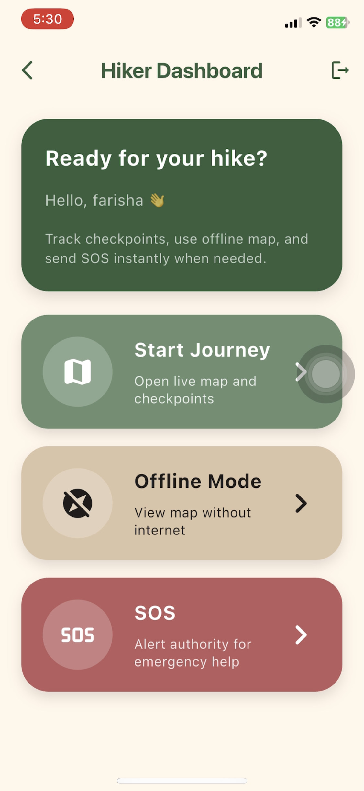
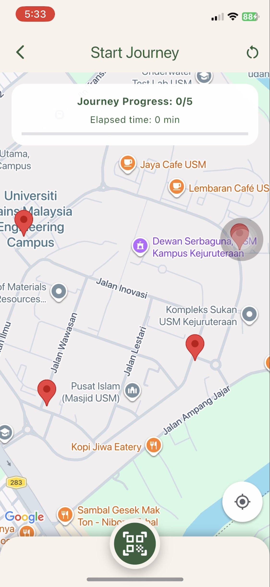
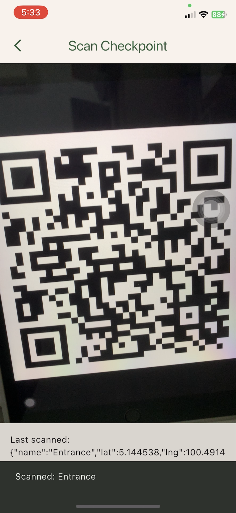
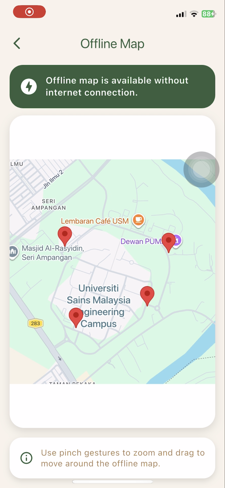
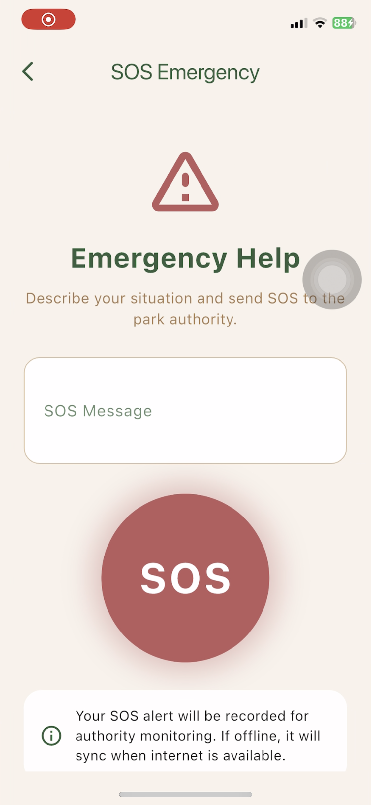
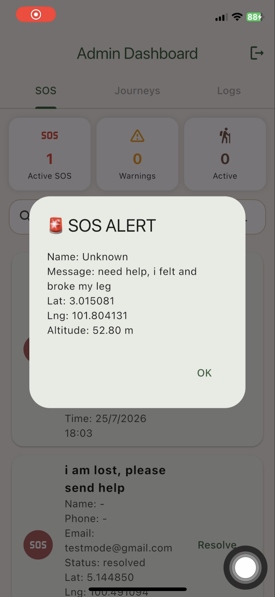
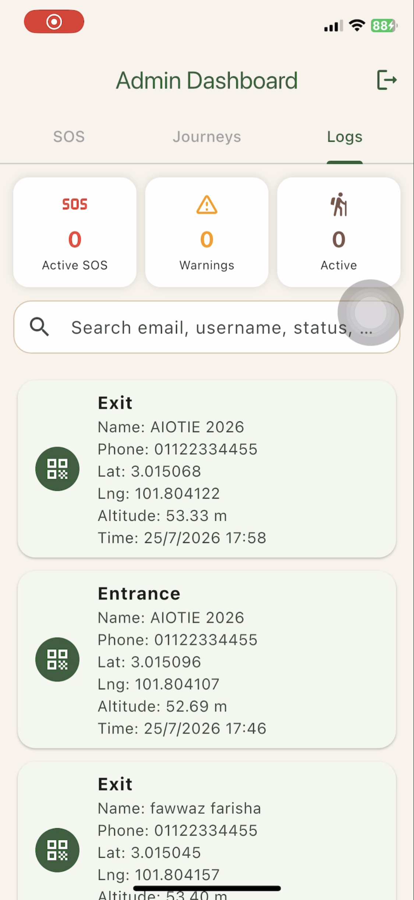

# 🌲 SmartSAR – Hiker Tracking & SOS System

**Development of a SAR Communication and Tracking System for a Forest Recreational Park**

SmartSAR is a mobile-based hiker tracking and emergency communication system developed to support search-and-rescue operations. The system allows hikers to record their journey progress, scan checkpoints, access offline information, and send SOS alerts when assistance is required.

The project was developed as my Final Year Project for my Bachelor of Mechatronic Engineering.

---

## 🎯 Project Objectives

- Develop a mobile system for tracking hiker progress during a journey.
- Provide an SOS communication feature for emergency situations.
- Maintain important journey data when internet connectivity is unavailable.
- Allow administrators to monitor hiker progress and emergency alerts.

---

## ✨ Key Features

### 📍 Journey Tracking
- GPS-based location tracking
- Start Journey function
- Journey progress monitoring
- Checkpoint markers on Google Maps

### 📱 QR Checkpoints
- QR code scanning at checkpoints
- Automatic checkpoint progress updates
- Visual indication of completed checkpoints

### 📴 Offline Operation
- Store journey information when internet connectivity is unavailable
- Synchronize stored data once the connection is restored
- Offline map access

### 🚨 SOS System
- Emergency SOS function
- Sends emergency information to the administrator
- Allows authorities to identify hikers requiring assistance

### 🖥 Admin Monitoring
- View SOS alerts
- Monitor hiker checkpoint progress
- Access stored journey information

---

## 🛠️ Technologies Used

| Technology | Purpose |
|---|---|
| Flutter | Mobile application development |
| Dart | Application programming |
| Firebase Authentication | User login and registration |
| Cloud Firestore | Cloud database |
| Google Maps | Hiker location and route display |
| GPS | Location tracking |
| QR Code Scanner | Checkpoint verification |
| Local Storage | Offline data handling |

---

## 🏗️ System Overview

The system consists of two main sides:

**Hiker Application**
- Login / Registration
- Start Journey
- GPS Tracking
- QR Checkpoint Scanning
- Offline Map
- SOS

**Administrator**
- View hiker progress
- Monitor checkpoint completion
- Receive SOS information

---

## 🧪 System Testing

The system was tested using real-device scenario-based testing.

The evaluation focused on:

- QR checkpoint scanning
- GPS accuracy
- Journey progress recording
- Offline data storage
- Data synchronization after reconnection
- SOS communication
- Data loss during offline operation

---

## 📱 Application Screens

<table>
  <tr>
    <td align="center">
      <b>Hiker Dashboard</b>  
      
    </td>
    <td align="center">
      <b>Journey Tracking</b>  
      
    </td>
  </tr>

  <tr>
    <td align="center">
      <b>QR Checkpoint Scanner</b>  
      
    </td>
    <td align="center">
      <b>Offline Map</b>  
      
    </td>
  </tr>

  <tr>
    <td align="center">
      <b>SOS Function</b>  
      
    </td>
    <td align="center">
      <b>Hiker SOS Alert</b>  
      
    </td>
  </tr>

  <tr>
    <td align="center" colspan="2">
      <b>Admin Dashboard</b>  
      
    </td>
  </tr>
</table>

---

## 🚀 Future Improvements

Potential improvements include:

- Push notifications for emergency alerts
- Geofencing
- More extensive testing in actual recreational forests
- Improved offline navigation
- Additional positioning technologies for areas with weak GPS signals

---

## 👩🏻‍💻 Author

**Wan Ainul Farisha**  
Bachelor of Mechatronic Engineering  
Universiti Sains Malaysia (USM)

Interested in Embedded Systems, IoT, Product Engineering and Mechatronics Engineering.
